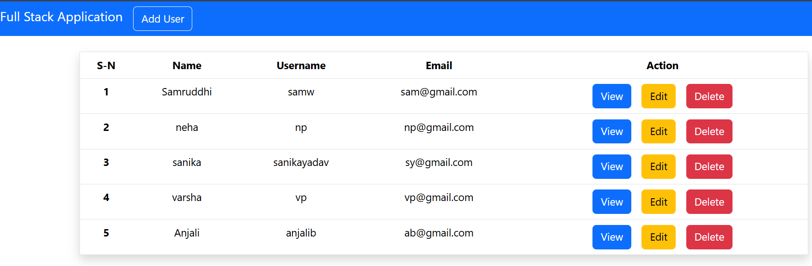
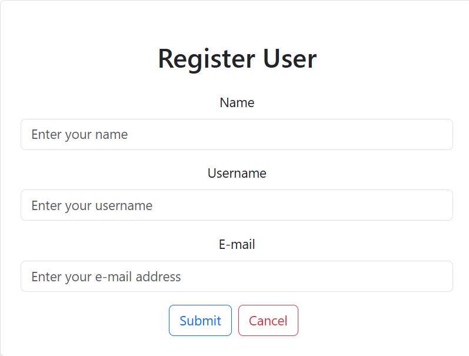
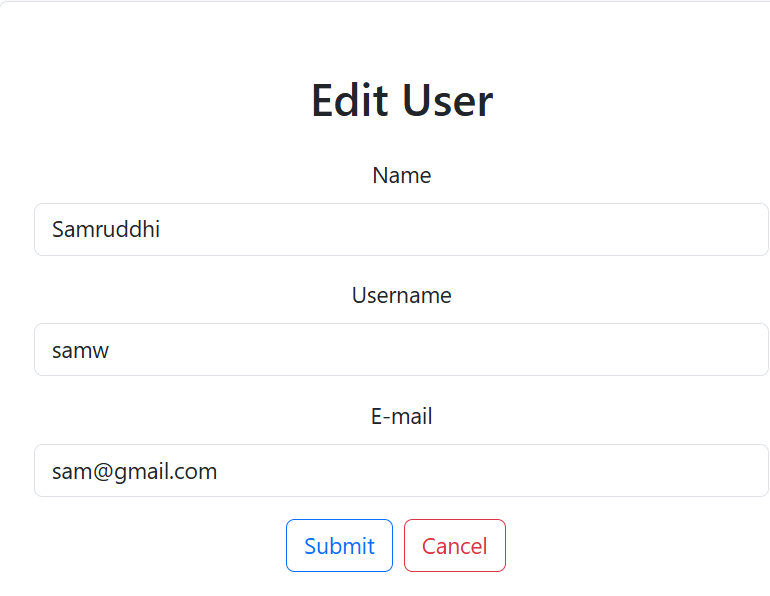
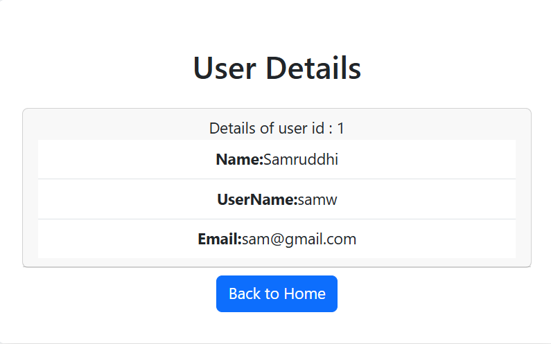

# UserManagementSystem
The **User Management System** is a full-stack web application built using **React, Spring Boot, and MySQL** to manage users with basic CRUD operations. It has a simple frontend and REST APIs for handling data. The project is containerized using **Docker** and runs easily using **Docker Compose**.


A full-stack **User Management System** built using:
- ⚛️ React (Frontend)
- ☕ Spring Boot (Backend)
- 🐬 MySQL (Database)
- 🐳 Docker (Containerization)

---

## 🚀 Features

- Add User
- Update User
- Delete User
- View All Users
- REST API Integration
- Dockerized Setup (One command run)

---

## 🛠 Tech Stack

### Frontend
- React.js
- Axios
- Bootstrap / Tailwind

### Backend
- Spring Boot
- Spring Data JPA
- REST APIs

### Database
- MySQL

### DevOps
- Docker
- Docker Compose

---

## 📁 Project Structure

```
User-Management-System/
│
├── frontend/
├── backend/
├── screenshots/
├── docker-compose.yml
└── README.md
```

---

## ⚙️ How to Run Project (Using Docker)

### 1️⃣ Clone Repository

```bash
git clone https://github.com/your-username/user-management-system.git
cd user-management-system
```

---

### 2️⃣ Run Using Docker Compose

```bash
docker-compose up --build
```

---

### 3️⃣ Access Application

- Frontend → http://localhost:3000
- Backend API → http://localhost:8081/users
- MySQL → localhost:3307

---

## 🧾 API Endpoints

| Method | Endpoint | Description |
|--------|----------|-------------|
| GET | /users | Get all users |
| POST | /users | Add new user |
| PUT | /users/{id} | Update user |
| DELETE | /users/{id} | Delete user |

---

## 🗄 Database Config

```properties
Database: userdb
Username: root
Password: root
```

---

## 🖼 Screenshots

### Dashboard


### Add


### Update


### View



---

## 🧪 Run Without Docker (Optional)

### Backend
```bash
cd backend
mvn spring-boot:run
```

### Frontend
```bash
cd frontend
npm install
npm start
```

---

## 📦 Stop Containers

```bash
docker-compose down
```

---

## 👨‍💻 Author

- Name: Samruddhi Warake
- GitHub: https://github.com/Samruddhi-Warake